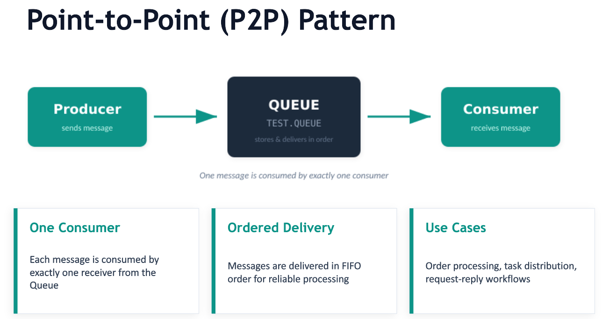
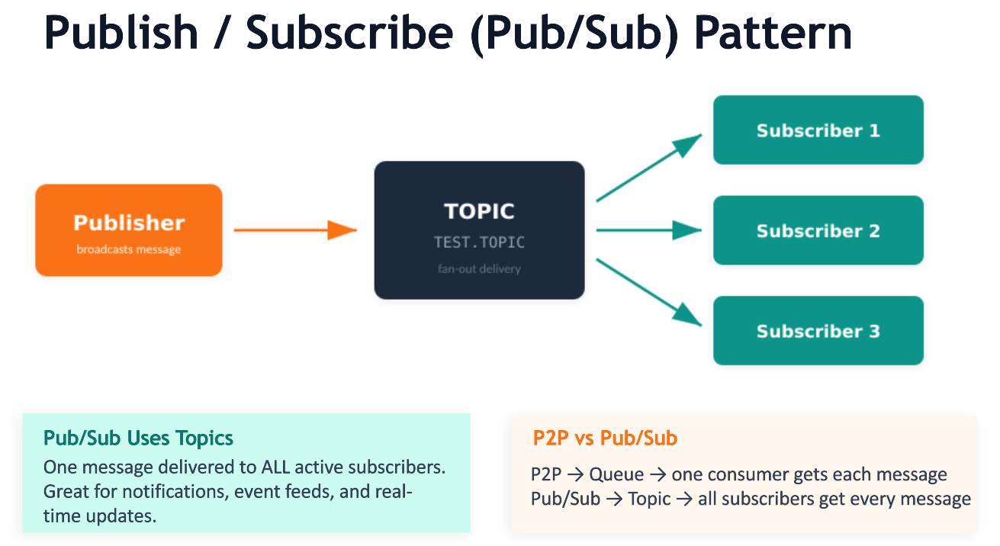
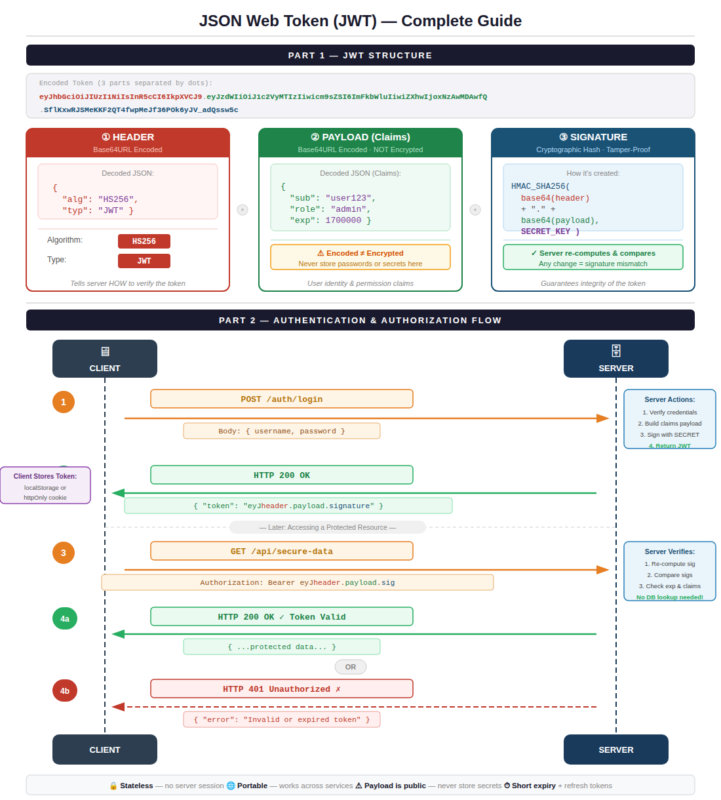
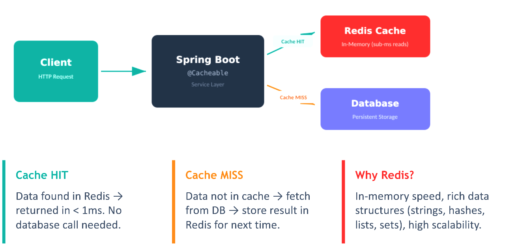

# Messaging, Security & Deployment

## Messaging

Messaging is a communication method used in software applications to exchange information between different components or systems. It allows for asynchronous communication, where messages are sent and received without the need for both parties to be active at the same time. This can improve scalability and decoupling of components.

JMS (Java Message Service) is a Java API that provides a standard way to create, send, receive, and read messages. It allows applications to communicate with each other using messaging systems like ActiveMQ, RabbitMQ, or Kafka.

### Messaging Communication Patterns

1. **Point-to-Point (P2P)**: In this pattern, messages are sent from a producer to a specific consumer. Each message is consumed by only one consumer. This is useful for tasks that require a single recipient, such as processing orders or handling requests.



This pattern ensures that messages are processed in a reliable and ordered manner, as each message is consumed by only one consumer. It is often used in scenarios where tasks need to be distributed among multiple workers, such as in a work queue.


2. **Publish/Subscribe (Pub/Sub)**: In this pattern, messages are published to a topic, and multiple subscribers can receive the same message. This is useful for broadcasting information to multiple recipients, such as notifications or updates.This pattern allows for a one-to-many communication model, where a single message can be consumed by multiple subscribers. It is often used in scenarios where information needs to be disseminated to multiple recipients, such as in a news feed or event notification system. Here, messages are not guaranteed to be processed in a specific order, as they can be consumed by multiple subscribers independently. This pattern is ideal for scenarios where the same information needs to be shared with multiple recipients, such as in a chat application or a stock price update system.



Usually the Pub/Sub pattern uses Topics, while the P2P pattern uses Queues. However, some messaging systems may allow for both patterns to be implemented using either topics or queues, depending on the specific requirements of the application.

#### ActiveMQ Setup

1. Download and install ActiveMQ from the official website: https://activemq.apache.org/components/classic/download/
2. Start the ActiveMQ broker by running the `activemq` script in the `bin` directory.

### Example JMS Messaging using Point-to-Point (P2P) Pattern

Below is an example of a JMS producer that sends a text message to a queue named "TEST.QUEUE" using ActiveMQ. The JMS consumer receives the message from the same queue and prints it to the console.

```java

import javax.jms.*;
import org.apache.activemq.ActiveMQConnectionFactory;

public class JMSProducer {
    public static void main(String[] args) {
        // Create a connection factory
        ConnectionFactory connectionFactory = new ActiveMQConnectionFactory("tcp://localhost:61616");

        try {
            // Create a connection
            Connection connection = connectionFactory.createConnection();
            connection.start();

            // Create a session
            Session session = connection.createSession(false, Session.AUTO_ACKNOWLEDGE);

            // Create a queue
            Destination destination = session.createQueue("TEST.QUEUE");

            // Create a message producer
            MessageProducer producer = session.createProducer(destination);
            producer.setDeliveryMode(DeliveryMode.NON_PERSISTENT);

            // Create a text message
            TextMessage message = session.createTextMessage("Hello, JMS!");

            // Send the message
            producer.send(message);
            System.out.println("Sent message: " + message.getText());

            // Clean up
            producer.close();
            session.close();
            connection.close();
        } catch (JMSException e) {
            e.printStackTrace();
        }
    }
}
```

#### Queue Consumer Example

In this example, we have a JMSProducer class that sends a text message to a queue named "TEST.QUEUE" using ActiveMQ. The JMSConsumer class receives the message from the same queue and prints it to the console. Make sure to run the ActiveMQ broker before executing these classes.


```java
import javax.jms.*;
import org.apache.activemq.ActiveMQConnectionFactory;
public class JMSConsumer {
    public static void main(String[] args) {
        // Create a connection factory
        ConnectionFactory connectionFactory = new ActiveMQConnectionFactory("tcp://localhost:61616");

        try {
            // Create a connection
            Connection connection = connectionFactory.createConnection();
            connection.start();

            // Create a session
            Session session = connection.createSession(false, Session.AUTO_ACKNOWLEDGE);

            // Create a queue
            Destination destination = session.createQueue("TEST.QUEUE");

            // Create a message consumer
            MessageConsumer consumer = session.createConsumer(destination);

            // Receive messages in a loop
            while (true) {
                Message message = consumer.receive(1000); // Wait for 1 seconds

                // Optionally, you can use consumer.receive() without a timeout to wait indefinitely for messages
                if (message == null) {
                    System.out.println("No more messages to receive. Exiting.");
                    break; // Exit the loop if no message is received
                }

                if (message instanceof TextMessage) {
                    TextMessage textMessage = (TextMessage) message;
                    System.out.println("Received message: " + textMessage.getText());
                } else {
                    System.out.println("Received non-text message");
                }
            }

            // Clean up
            consumer.close();
            session.close();
            connection.close();
        } catch (JMSException e) {
            e.printStackTrace();
        }
    }
}
``` 

#### Dependencies using Maven and JDK17

```xml
<dependencies>
    <dependency>
        <groupId>org.apache.activemq</groupId>
        <artifactId>activemq-all</artifactId>
        <version>5.16.3</version>
    </dependency>
</dependencies>
```

### Example JMS Messaging using Publish/Subscribe (Pub/Sub) Pattern

Below is an example of a JMS publisher that sends a text message to a topic named "TEST.TOPIC" using ActiveMQ. The JMS subscriber receives the message from the same topic and prints it to the console.

```java
import javax.jms.*;
import org.apache.activemq.ActiveMQConnectionFactory;
public class JMSPublisher {
    public static void main(String[] args) {
        // Create a connection factory
        ConnectionFactory connectionFactory = new ActiveMQConnectionFactory("tcp://localhost:61616");

        try {
            // Create a connection
            Connection connection = connectionFactory.createConnection();
            connection.start();

            // Create a session
            Session session = connection.createSession(false, Session.AUTO_ACKNOWLEDGE);

            // Create a topic
            Destination destination = session.createTopic("TEST.TOPIC");

            // Create a message producer
            MessageProducer producer = session.createProducer(destination);
            producer.setDeliveryMode(DeliveryMode.NON_PERSISTENT);

            // Create a text message
            TextMessage message = session.createTextMessage("Hello, JMS Pub/Sub!");

            // Send the message
            producer.send(message);
            System.out.println("Sent message: " + message.getText());

            // Clean up
            producer.close();
            session.close();
            connection.close();
        } catch (JMSException e) {
            e.printStackTrace();
        }
    }
}
```

#### Subscriber 
In this example, we have a JMSPublisher class that sends a text message to a topic named "TEST.TOPIC" using ActiveMQ. The JMSSubscriber class receives the message from the same topic and prints it to the console. Make sure to run the ActiveMQ broker before executing these classes.

```java
import javax.jms.*;
import org.apache.activemq.ActiveMQConnectionFactory;
public class JMSSubscriber {
    public static void main(String[] args) {
        // Create a connection factory
        ConnectionFactory connectionFactory = new ActiveMQConnectionFactory("tcp://localhost:61616");
        try {
            // Create a connection
            Connection connection = connectionFactory.createConnection();
            connection.start();

            // Create a session
            Session session = connection.createSession(false, Session.AUTO_ACKNOWLEDGE);

            // Create a topic
            Destination destination = session.createTopic("TEST.TOPIC");

            // Create a message consumer
            MessageConsumer consumer = session.createConsumer(destination);

            // Receive messages in a loop
            while (true) {
                Message message = consumer.receive(1000); // Wait for 1 seconds

                if (message == null) {
                    System.out.println("No more messages to receive. Exiting.");
                    break; // Exit the loop if no message is received
                }

                if (message instanceof TextMessage) {
                    TextMessage textMessage = (TextMessage) message;
                    System.out.println("Received message: " + textMessage.getText());
                } else {
                    System.out.println("Received non-text message");
                }
            }

            // Clean up
            consumer.close();
            session.close();
            connection.close();
        } catch (JMSException e) {
            e.printStackTrace();
        }   
    }
}
```

NOTE: Run multiple instances of the JMSSubscriber class to see the publish/subscribe pattern in action, where multiple subscribers receive the same message from the topic.

## REST API Security

Security in software applications is crucial to protect sensitive data, ensure the integrity of the system, and prevent unauthorized access. It involves implementing various measures such as authentication, authorization, encryption, and secure coding practices.

Authentication is the process of verifying the identity of a user or system, while authorization determines what actions an authenticated user is allowed to perform. Encryption is used to protect data from being accessed by unauthorized parties, both in transit and at rest. Secure coding practices involve writing code that is resistant to common vulnerabilities such as SQL injection, cross-site scripting (XSS), and buffer overflows.

API security is a critical aspect of modern software development, especially with the increasing reliance on APIs for communication between different systems and services. It involves implementing measures to protect APIs from unauthorized access, data breaches, and other security threats. This can include using authentication and authorization mechanisms, encrypting sensitive data, and following secure coding practices to prevent vulnerabilities in the API implementation.

API security can be achieved through various methods, such as using API keys, OAuth tokens, or JWT (JSON Web Tokens) for authentication and authorization. Additionally, implementing rate limiting, input validation, and logging can help protect APIs from abuse and detect potential security incidents.


### Applying JWT Authentication to REST API using SpringBoot3

JWT (JSON Web Token) is a compact, URL-safe means of representing claims to be transferred between two parties. It is commonly used for authentication and authorization in web applications. 

Below diagram depicts the flow of JWT authentication in a REST API:

1. The client sends a POST request to the authentication endpoint (e.g., `/authenticate`) with the user's credentials (username and password).
2. The server validates the credentials and, if they are correct, generates a JWT token containing the user's information and permissions.
3. The server sends the JWT token back to the client in the response.
4. The client stores the JWT token (e.g., in local storage or a cookie) and includes it in the `Authorization` header of subsequent requests to protected endpoints (e.g., `/hello`).
5. The server receives the request, extracts the JWT token from the `Authorization` header, and validates it. If the token is valid, the server processes the request and returns the appropriate response. If the token is invalid or expired, the server returns an unauthorized error.



### Example using JWT authentication with REST API and Spring Boot 3.

Add the following dependencies to your `pom.xml`:

```xml

<dependencies>
    <dependency>    
        <groupId>org.springframework.boot</groupId>
        <artifactId>spring-boot-starter-security</artifactId>
    </dependency>
    <dependency>
        <groupId>io.jsonwebtoken</groupId>
        <artifactId>jjwt</artifactId>
        <version>0.9.1</version>    
    </dependency>
</dependencies>

```

1. Create a `User` class to represent the user entity.

```java

public class User {
    private String username;
    private String password;    
    // Getters and setters
}

```

2. Create a `JwtUtil` class to handle JWT token generation and validation.

```java

import io.jsonwebtoken.Claims;
import io.jsonwebtoken.Jwts;
import io.jsonwebtoken.SignatureAlgorithm;
import java.util.Date;  

public class JwtUtil {

    private String secretKey = "mySecretKey";

    public String generateToken(String username) {
        return Jwts.builder()
                .setSubject(username)
                .setIssuedAt(new Date())
                .setExpiration(new Date(System.currentTimeMillis() + 1000 * 60 * 60 * 10)) // 10 hours
                .signWith(SignatureAlgorithm.HS256, secretKey)
                .compact();
    }

    public String extractUsername(String token) {
        return extractClaims(token).getSubject();
    }   

    public boolean validateToken(String token, String username) {
        return extractUsername(token).equals(username) && !isTokenExpired(token);
    }

    private Claims extractClaims(String token) {
        return Jwts.parser().setSigningKey(secretKey).parseClaimsJws(token).getBody();
    }

    private boolean isTokenExpired(String token) {
        return extractClaims(token).getExpiration().before(new Date());     
    }
}
```

3. Create a `JwtRequestFilter` to intercept incoming requests and validate the JWT token.

```java
import org.springframework.beans.factory.annotation.Autowired;
import org.springframework.security.core.context.SecurityContextHolder;
import org.springframework.security.web.authentication.WebAuthenticationDetailsSource;
import org.springframework.stereotype.Component;
import org.springframework.web.filter.OncePerRequestFilter;
import javax.servlet.FilterChain;
import javax.servlet.ServletException;      
import javax.servlet.http.HttpServletRequest;
import javax.servlet.http.HttpServletResponse;
import java.io.IOException;

@Component
public class JwtRequestFilter extends OncePerRequestFilter {

    @Autowired
    private JwtUtil jwtUtil;
    
    @Override   
    protected void doFilterInternal(HttpServletRequest request, HttpServletResponse response, FilterChain chain)
            throws ServletException, IOException {

        final String authorizationHeader = request.getHeader("Authorization");
        String username = null;
        String jwt = null;

        if (authorizationHeader != null && authorizationHeader.startsWith("Bearer ")) {
            jwt = authorizationHeader.substring(7);
            username = jwtUtil.extractUsername(jwt);
        }

        if (username != null && SecurityContextHolder.getContext().getAuthentication() == null) {
            if (jwtUtil.validateToken(jwt, username)) {
                // Set authentication in the context
                UsernamePasswordAuthenticationToken authenticationToken = 
                    new UsernamePasswordAuthenticationToken(username, null, new ArrayList<>());
                SecurityContextHolder.getContext().setAuthentication(authenticationToken);
            }   
        }
        
        chain.doFilter(request, response);
    }
}
```
4. Configure Spring Security to use the `JwtRequestFilter`.

```java
import org.springframework.beans.factory.annotation.Autowired;
import org.springframework.context.annotation.Bean;
import org.springframework.context.annotation.Configuration;
import org.springframework.security.authentication.AuthenticationManager;
import org.springframework.security.config.annotation.authentication.builders.AuthenticationManagerBuilder;
import org.springframework.security.config.annotation.web.builders.HttpSecurity;    
import org.springframework.security.config.annotation.web.configuration.EnableWebSecurity;
import org.springframework.security.config.annotation.web.configuration.WebSecurityConfigurerAdapter;
import org.springframework.security.config.http.SessionCreationPolicy;
import org.springframework.security.web.authentication.UsernamePasswordAuthenticationFilter;

@Configuration
@EnableWebSecurity
public class SecurityConfig extends WebSecurityConfigurerAdapter {

    @Autowired
    private JwtRequestFilter jwtRequestFilter;  

    @Override
    protected void configure(HttpSecurity http) throws Exception {
        http.csrf().disable()
            .authorizeRequests().antMatchers("/authenticate").permitAll()
            .anyRequest().authenticated()
            .and().sessionManagement().sessionCreationPolicy(SessionCreationPolicy.STATELESS);
        http.addFilterBefore(jwtRequestFilter, UsernamePasswordAuthenticationFilter.class);
    }

    @Override
    protected void configure(AuthenticationManagerBuilder auth) throws Exception {
        // Configure authentication provider (e.g., in-memory, JDBC, etc.)
    }

    @Bean
    @Override
    public AuthenticationManager authenticationManagerBean() throws Exception {
        return super.authenticationManagerBean();
    }
}
``` 

5. Create an authentication endpoint to generate JWT tokens.

```java
import org.springframework.beans.factory.annotation.Autowired;
import org.springframework.security.authentication.AuthenticationManager;
import org.springframework.security.authentication.UsernamePasswordAuthenticationToken;     
import org.springframework.web.bind.annotation.PostMapping;
import org.springframework.web.bind.annotation.RequestBody;
import org.springframework.web.bind.annotation.RestController;  

@RestController 
public class AuthenticationController {
    
    @Autowired
    private AuthenticationManager authenticationManager;
    
    @Autowired
    private JwtUtil jwtUtil;
    
    @PostMapping("/authenticate")
    public String createAuthenticationToken(@RequestBody User user) throws Exception {
        try {
            authenticationManager.authenticate(
                    new UsernamePasswordAuthenticationToken(user.getUsername(), user.getPassword())
            );
        } catch (Exception e) {
            throw new Exception("Incorrect username or password", e);
        }
        return jwtUtil.generateToken(user.getUsername());
    }
}
``` 

6. Now, you can run your Spring Boot application and test the authentication flow by sending a POST request to `/authenticate` with a valid username and password. You will receive a JWT token in response, which can be used to access protected endpoints by including it in the `Authorization` header as a Bearer token.   

7. You can create additional REST endpoints that require authentication, and the `JwtRequestFilter` will ensure that only requests with valid JWT tokens can access those endpoints.

8. Consider a sample endpoint that requires authentication:

```java
import org.springframework.web.bind.annotation.GetMapping;
import org.springframework.web.bind.annotation.RestController;

@RestController 
public class SampleController {

    @GetMapping("/hello")
    public String hello() {
        return "Hello, authenticated user!";
    }

}
```

Here, the `/hello` endpoint will only be accessible to users who have a valid JWT token. When a request is made to this endpoint, the `JwtRequestFilter` will validate the token and allow access if it is valid. 
Below are the steps to test the authentication flow:
1. Start the Spring Boot application.
2. Send a POST request to `/authenticate` with a valid username and password to receive a JWT token.
3. Use the received JWT token to access the protected endpoint (e.g., `/hello`)

```shell
curl -X POST http://localhost:8080/authenticate -H "Content-Type: application/json" -d '{"username":"user1","password":"password1"}'

curl -X GET http://localhost:8080/hello -H "Authorization: Bearer <JWT_TOKEN_H>" 
```

Replace `<JWT_TOKEN_H>` with the actual JWT token received from the authentication endpoint. If the token is valid, you should receive a response from the `/hello` endpoint. If the token is invalid or expired, you will receive an unauthorized error.


## Logging Frameworks

Logging is an essential aspect of software development that helps developers and system administrators monitor and troubleshoot applications. It involves recording events, errors, and other relevant information during the execution of a program. Logging frameworks provide a structured way to manage and output log messages, making it easier to analyze and debug applications.

Some popular logging frameworks in Java include:

1. **Log4j**: A widely used logging framework that provides a flexible and configurable logging system. It supports various log levels (e.g., DEBUG, INFO, WARN, ERROR) and allows for different output destinations (e.g., console, file, database).

2. **SLF4J (Simple Logging Facade for Java)**: A logging facade that provides a simple API for logging, allowing developers to choose their preferred logging framework (e.g., Log4j, Logback) at runtime without changing the code.

3. **Logback**: A logging framework that is intended as a successor to Log4j. It offers improved performance and features, such as automatic reloading of configuration files and support for advanced filtering and formatting options.


### Example of using Logback for logging in a SpringBoot3 application:

1. Add the following dependency to your `pom.xml`:

```xml
<dependencies>
    <dependency>
        <groupId>ch.qos.logback</groupId>
        <artifactId>logback-classic</artifactId>
        <version>1.2.3</version>    
    </dependency>
</dependencies>
```
2. Create a `logback.xml` configuration file in the `src/main/resources` directory to configure the logging behavior.

```xml
<configuration>
    <appender name="CONSOLE" class="ch.qos.logback.core.ConsoleAppender">
        <encoder>
            <pattern>%d{yyyy-MM-dd HH:mm:ss} %-5level %logger{36} - %msg%n</pattern>
        </encoder>
    </appender>     
    <root level="debug">
        <appender-ref ref="CONSOLE" />
    </root>
</configuration>
```

Appender defines where the log messages will be output (in this case, to the console), and the pattern specifies the format of the log messages. The root logger is set to the DEBUG level, which means that all log messages at DEBUG level and above will be logged.

3. Use the logger in your Spring Boot application to log messages at different levels.

```java
import org.slf4j.Logger;
import org.slf4j.LoggerFactory;
import org.springframework.web.bind.annotation.GetMapping;
import org.springframework.web.bind.annotation.RestController;  

@RestController
public class LoggingController {
    private static final Logger logger = LoggerFactory.getLogger(LoggingController.class);

    @GetMapping("/log")
    public String logExample() {
        logger.debug("This is a DEBUG message");
        logger.info("This is an INFO message");
        logger.warn("This is a WARN message");
        logger.error("This is an ERROR message");
        return "Check the logs for different log levels!";
    }
}
```     

4. Run your Spring Boot application and access the `/log` endpoint to see the log messages in the console output. You will see messages for each log level (DEBUG, INFO, WARN, ERROR) formatted according to the pattern specified in the `logback.xml` configuration file.

```shell 
curl -X GET http://localhost:8080/log
``` 

## Caching (Using SpringBoot3 and Redis)

Caching is a technique used to improve the performance of applications by storing frequently accessed data in memory or other fast storage systems. This allows for quicker retrieval of data, reducing the need to access slower storage mediums like databases or external APIs.

Redis is an in-memory data structure store that can be used as a cache. It supports various data structures such as strings, hashes, lists, sets, and more. Redis is known for its high performance and scalability, making it a popular choice for caching in modern applications.

Below diagram illustrates how caching with Redis works in a Spring Boot application if applied along with database interaction:



Below is an example of how to use Redis for caching in a Spring Boot 3 application:

1. Add the following dependencies to your `pom.xml`:

```xml
<dependencies>
    <dependency>
        <groupId>org.springframework.boot</groupId>
        <artifactId>spring-boot-starter-data-redis</artifactId>
    </dependency>
    <dependency>
        <groupId>redis.clients</groupId>
        <artifactId>jedis</artifactId>  
        <version>3.6.0</version>
    </dependency>
</dependencies> 
```
2. Configure Redis connection properties in your `application.properties` file.

```properties
spring.redis.host=localhost
spring.redis.port=6379
``` 

3. Optionally define the cache manager bean in your configuration class to customize the caching behavior.

```java
import org.springframework.cache.CacheManager;
import org.springframework.cache.annotation.EnableCaching;
import org.springframework.context.annotation.Bean;
import org.springframework.context.annotation.Configuration;
import org.springframework.data.redis.cache.RedisCacheManager;
import org.springframework.data.redis.core.RedisTemplate;   

@Configuration
@EnableCaching
public class CacheConfig {
    @Bean
    public CacheManager cacheManager(RedisTemplate<String, Object> redisTemplate) {
        return RedisCacheManager.builder(redisTemplate.getConnectionFactory()).build();
    }
}
``` 

It is optional to define the cache manager bean, as Spring Boot will automatically configure a default cache manager if you have the necessary dependencies. However, defining your own cache manager allows you to customize the caching behavior, such as setting cache expiration times, configuring cache names, or using different serialization strategies for cached data.

4. Create a service class that uses Redis for caching.

```java
import org.springframework.beans.factory.annotation.Autowired;
import org.springframework.cache.annotation.Cacheable;
import org.springframework.data.redis.core.RedisTemplate;
import org.springframework.stereotype.Service;  

@Service
public class CachingService {   
    @Autowired
    private RedisTemplate<String, Object> redisTemplate;

    @Cacheable(value = "dataCache", key = "#id")
    public String getDataById(String id) {
        // Simulate a time-consuming operation (e.g., database query)
        try {
            Thread.sleep(3000); // Simulate delay
        } catch (InterruptedException e) {
            e.printStackTrace();
        }
        return "Data for ID: " + id;
    }
}
``` 

In this example, the `getDataById` method is annotated with `@Cacheable`, which indicates that the result of this method should be cached. The `value` attribute specifies the name of the cache (in this case, "dataCache"), and the `key` attribute specifies how to generate the cache key (using the method parameter `id`). When this method is called for the first time with a specific `id`, it will execute the simulated time-consuming operation and store the result in the Redis cache. Subsequent calls with the same `id` will return the cached result without executing the time-consuming operation, improving performance.

5. Create a controller to test the caching functionality.

```java
import org.springframework.beans.factory.annotation.Autowired;
import org.springframework.web.bind.annotation.GetMapping;
import org.springframework.web.bind.annotation.PathVariable;
import org.springframework.web.bind.annotation.RestController;

@RestController
public class CachingController {

    @Autowired
    private CachingService cachingService;

    @GetMapping("/cached-data/{id}")
    public String getCachedData(@PathVariable String id) {
        return cachingService.getDataById(id);
    }
}
```

6. Run your Spring Boot application and access the `/cached-data/{id}` endpoint to see the caching in action. The first time you access the endpoint with a specific `id`, it will take longer to respond due to the simulated delay. However, subsequent requests with the same `id` will return the cached result much faster.

```shell
curl -X GET http://localhost:8080/cached-data/123
```

Caching can be applied at multiple levels in an application, such as method-level caching (as shown in the example), query-level caching, or even at the HTTP response level. It is important to choose the appropriate caching strategy based on the specific use case and requirements of your application.

## Containerization: Docker, CI pipeline using Jenkins

Containerization is a technology that allows developers to package applications and their dependencies into a single, portable unit called a container. Docker is a popular containerization platform that provides tools for creating, managing, and deploying containers. 

Containers are lightweight and isolated, allowing applications to run consistently across different environments, such as development, testing, and production. This helps to eliminate issues related to environment differences and makes it easier to deploy applications. They use the host operating system's kernel, which allows them to be more efficient than traditional virtual machines. 

CI (Continuous Integration) is a software development practice where developers frequently integrate their code changes into a shared repository, and automated builds and tests are run to ensure that the code is working correctly. Jenkins is a widely used open-source automation server that can be used to implement CI pipelines.

Basic docker tutorial commands to play with docker: 

```shell
docker run redis # Run a Redis container
docker images # List all Docker images

docker ps # List running containers
docker ps -a # List all containers (including stopped ones)

docker stop <container_id> # Stop a running container
docker rm <container_id> # Remove a container

docker rmi <image_id> # Remove a Docker image

docker logs <container_id> # View logs of a container

docker exec -it <container_id> bash # Access the shell of a running container
```

### Example of containerizing a Spring Boot application using Docker and setting up a CI pipeline with Jenkins:

1. Create a `Dockerfile` in the root directory of your Spring Boot application to define how the application should be containerized.

```dockerfile

# Use an official OpenJDK runtime as a parent image
FROM openjdk:17-jdk-slim
# Set the working directory in the container
WORKDIR /app
# Copy the packaged JAR file into the container
COPY target/my-spring-boot-app.jar app.jar
# Expose the port that the application will run on
EXPOSE 8080
# Define the command to run the application
ENTRYPOINT ["java", "-jar", "app.jar"]
``` 

2. Build the Docker image for your Spring Boot application.

```shell
docker build -t my-spring-boot-app .
``` 

3. Run the Docker container to test that the application is working correctly.

```shell
docker run -p 8080:8080 my-spring-boot-app
```

4. Set up a Jenkins pipeline to automate the build and deployment process. You can create a `Jenkinsfile` in the root directory of your project to define the pipeline stages.

```groovy
pipeline {
    agent any
    stages {
        stage('Build') {
            steps {
                // Build the Spring Boot application using Maven
                sh 'mvn clean package -DskipTests'
            }
        }
        stage('Build Docker Image') {
            steps {
                // Build the Docker image
                sh 'docker build -t my-spring-boot-app .'
            }
        }
        stage('Push Docker Image') {
            steps {
                // Push the Docker image to a registry (e.g., Docker Hub)
                sh 'docker tag my-spring-boot-app my-dockerhub-username/my-spring-boot-app:latest'
                sh 'docker push my-dockerhub-username/my-spring-boot-app:latest'
            }
        }
        stage('Deploy') {
            steps {
                // Deploy the application (e.g., using Kubernetes or another container orchestration tool)
                sh 'kubectl apply -f deployment.yaml'
            }
        }
    }
}
```

Now you can commit your code to a Git repository, and Jenkins will automatically trigger the pipeline to build the application, create a Docker image, push it to a registry, and deploy it to your chosen environment. This automation helps ensure that your application is consistently built and deployed with minimal manual intervention.

Connecting your repository to Jenkins and configuring the pipeline will allow you to streamline your development workflow and ensure that your application is always up-to-date and running smoothly in production. 

Below are the steps to integrate Jenkins with your Git repository and set up the pipeline:

1. Install Jenkins on your server and set up the necessary plugins (e.g., Git plugin, Docker plugin).
2. Create a new Jenkins job and select "Pipeline" as the project type.
3. In the pipeline configuration, select "Pipeline script from SCM" and choose your Git repository as the source.
4. Specify the branch and the path to your `Jenkinsfile` in the repository.
5. Save the configuration and trigger the pipeline to run. Jenkins will execute the stages defined in the `Jenkinsfile`, building your application, creating the Docker image, pushing it to the registry, and deploying it to your environment.    

## GIT operations using GitHub

**Git** is a distributed version control system that allows developers to track changes in their code and collaborate with others. A version control system helps manage changes to source code over time, allowing multiple developers to work on the same codebase without conflicts. Git provides features such as branching, merging, and commit history, which enable developers to work on different features or bug fixes simultaneously and then merge their changes back into the main codebase. Git supports the following phases in the software development lifecycle:

1. **Development**: Developers create and modify code in their local repositories, making commits to track changes.

2. **Testing**: Developers can create branches to test new features or bug fixes without affecting the main codebase. Once testing is complete, changes can be merged back into the main branch.

3. **Deployment**: Git can be used to manage the deployment process by tagging specific commits for release and using hooks to automate deployment tasks.

**GitHub** is a web-based platform that provides hosting for Git repositories, along with additional features such as issue tracking, pull requests, and collaboration tools. GitHub allows developers to manage their code repositories, collaborate with other developers, and contribute to open-source projects.

Steps to use Git for version control:

1. **Initialize a Git repository**: You can initialize a Git repository in your project directory using the command `git init`. This creates a new Git repository where you can start tracking changes to your code.

2. **Add files to staging area**: To track changes to specific files, you can add them to the staging area using the command `git add <file-name>` or `git add .` to add all changes.

3. **Commit changes**: After staging your changes, you can commit them to the repository with a descriptive message using the command `git commit -m "Your commit message"`.

4. **Create branches**: To work on new features or bug fixes without affecting the main codebase, you can create a new branch using the command `git checkout -b <branch-name>`. For example, `git checkout -b feature/new-feature` will create and switch to a new branch called "feature/new-feature".

5. **Push changes to remote repository**: To share your changes with others, you can push your commits to a remote repository (e.g., GitHub) using the command `git push origin <branch-name>`. For example, `git push origin feature/new-feature` will push the changes in the "feature/new-feature" branch to GitHub.

Prerequisites:
- Git installed on your local machine
- A GitHub account and a repository created to host your code

Steps for creating a new repository on GitHub:
1. Log in to your GitHub account and navigate to the "Repositories" tab.
2. Click on the "New" button to create a new repository.
3. Fill in the repository name, description (optional), and choose the visibility (public or private).
4. Click on the "Create repository" button to create the repository.
5. You will be provided with the repository URL and necesssary commands to initialize your local Git repository and connect it to the remote repository on GitHub.

Below is the basic tutorial to play around with Git and GitHub for version control and collaboration in software development.

```shell 
# Initialize a new Git repository
git init

# Add remote repository (replace <repository-url> with your GitHub repository URL)
git remote add origin <repository-url>

# Add files to staging area
git add .

# Commit changes with a message
git commit -m "Initial commit"

# Create a new branch for a feature
git checkout -b main

# Make changes to your code and commit them
git add .
git commit -m "Add new feature"

# Push changes to GitHub
git push origin main
```

